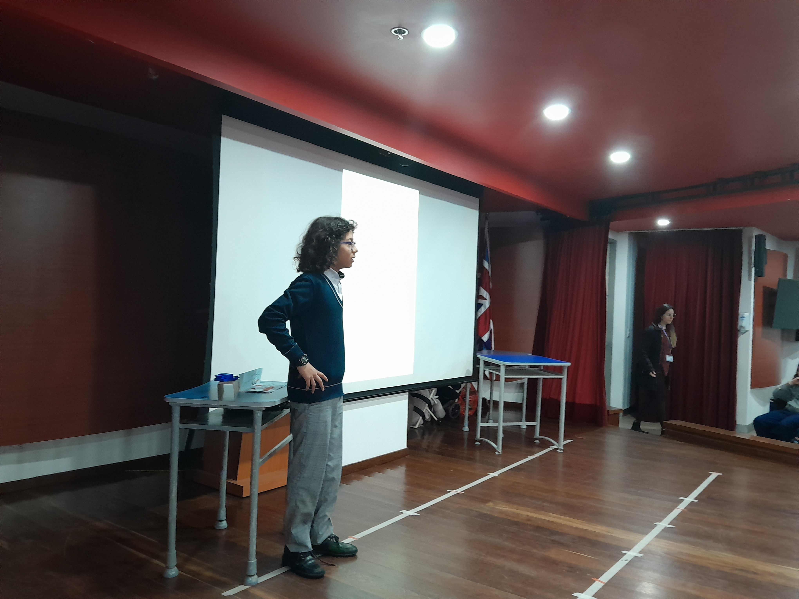
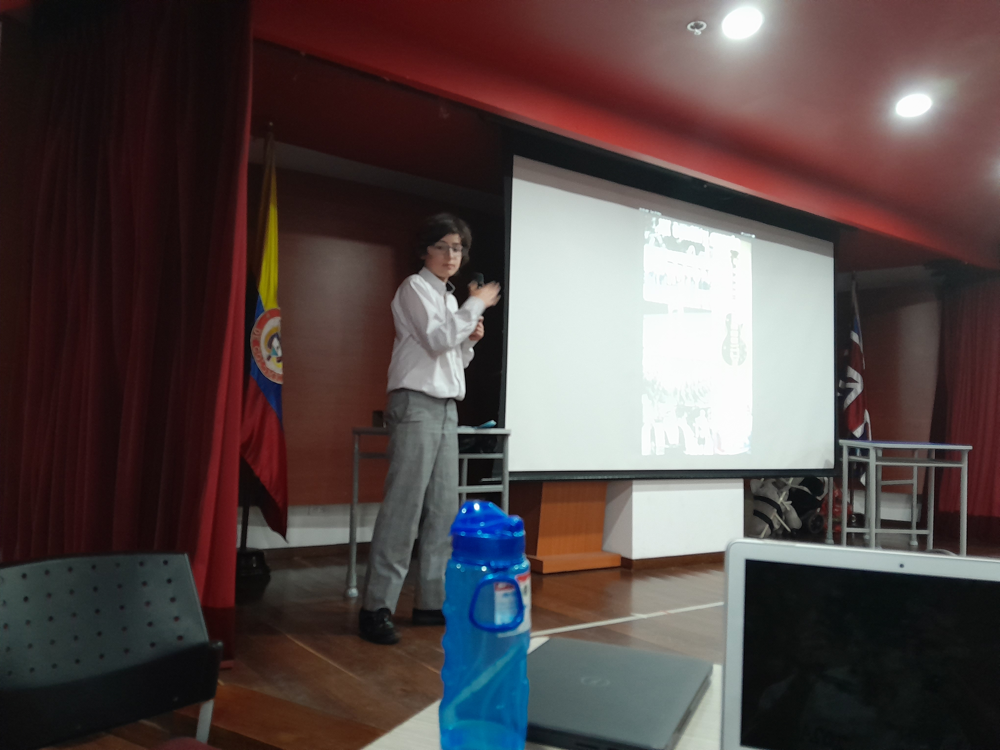
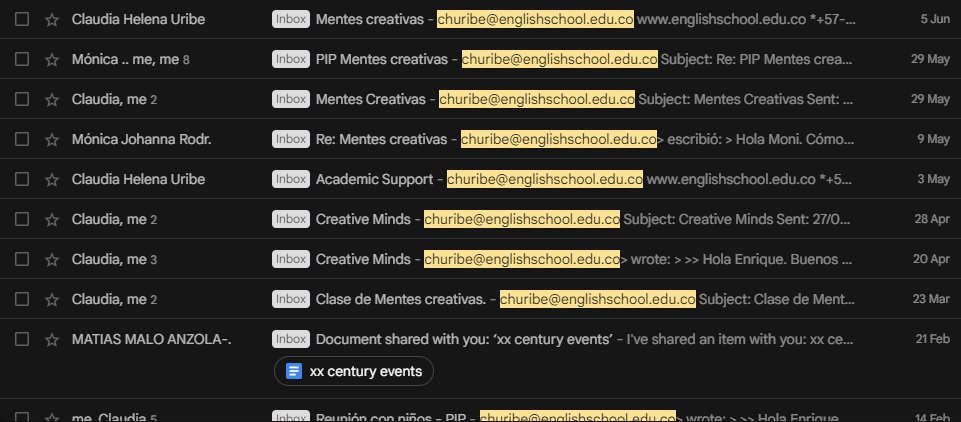
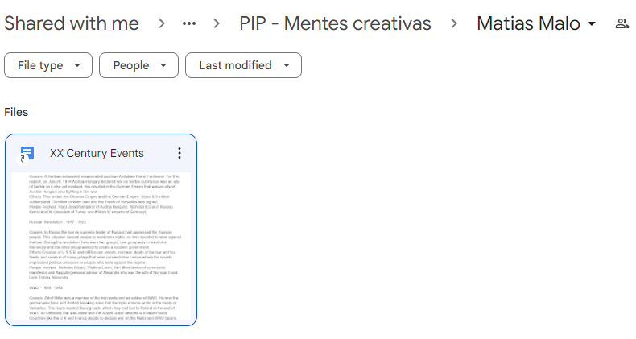

### Introducción

**Propósito de la iniciativa**: Este proyecto de iniciativa personal (PIP) tiene como propósito acompañar y apoyar a niños particularmente creativos y curiosos quienes están en el programa de Mentes Creativas en The English School (TES). La edad de los participantes oscila entre 6 y 10 años y muestran interés y pasión por los procesos de aprendizaje extracurriculares.

**Selección del proyecto**: Decidí seleccionar este proyecto porque fue algo en lo que yo consideré que podría tener un impacto positivo, pues los niños de Mentes Creativas son muy inteligentes y curiosos, pero con frecuencia tienen dificultades organizando sus ideas o desarrollando en su finalidad un proceso de trabajo, pues no tienen la experiencia para medir y balancear su pasión del conocimiento por la eficacia que requiere el mundo real. 

Dado que soy una persona muy organizada y estructurada, lo cual se demuestra en mis resultados académicos, pensé que podría ayudar a estos niños en sus áreas más débiles, ayudándoles a construir habilidades de organización y enfoque, mientras ellos se concentraban en lo que realmente les apasionaba.

**Lugar y tiempo de ejecución del proyecto**: El proyecto será un acompañamiento constante a un par de estudiantes que comenzará a mediados de febrero de 2023 y concluirá con las presentaciones de los proyectos de los niños el 30 de mayo de 2023.

**Duración del proyecto**: El proyecto tiene una duración de  3 meses y medio aproximadamente. Es importante anotar que al considerar periodos de receso de Semana Santa y otros estipulados en el calendario académico 2022-2023 del TES, el tiempo efectivo del proyecto se reduce a 2 meses y medio.

**Seguimiento del proyecto**: Por la naturaleza del proyecto, la idea es que cada uno de los dos estudiantes que estaré acompañando trabaje de la manera más independiente posible en su proyecto, y yo les ayudé con las habilidades que no han desarrollado, como organización, estructuración, e indagación. Por lo tanto, estaré revisando periódicamente el progreso del proyecto de cada estudiante, y agendando reuniones con ellos y sus supervisores del departamento de Learning Support del colegio para dar mi retroalimentación o preguntar en qué aspectos específicos puede contribuir.

### Investigación

**Habilidades  y talentos para el proyecto**: Para realizar el proyecto, mi contribución principal partirá de mis habilidades de organización, planificación e indagación que he desarrollado a través de mi vida.

**Necesidades a abordar**: Las necesidades de mis estudiantes a abordar son sus deficiencias en el manejo del tiempo y limitaciones en conceptos de organización investigativa que les ayude en su proceso de aprendizaje.

**Información a recolectar para el proyecto**: Antes de iniciar el proyecto, realice una identificación de los estudiantes en programa de mentes creativas, la cual se obtuvo mediante reuniones con la líder del departamento de Learning Support. La asignación de 2 de ellos se realizó de común acuerdo con el instructor. Por lo tanto, fui asignado con Alejandro Morales de grado cuarto, cuyo proyecto se basaba en eventos importantes de la Primera y Segunda Guerra Mundial, y Matías Malo de cuarto, quien estaba interesado en hitos importantes del siglo XX.

**Información adicional**: Luego de haber conocido a los estudiantes a quienes iba a acompañar y entender más sobre sus intereses e ideas iniciales para sus proyectos, realice una investigación general sobre cada tema para estar contextualizado y facilitar la comunicación con ellos.

### Preparación

**Rol en el proyecto**: Durante el proyecto, me desempeñé como tutor de Matías Malo y Alejandro Morales.

**Responsabilidades en el proyecto**: Mis responsabilidades en el transcurso del proyecto fueron: 

- Tener reuniones con los estudiantes
- Revisar avances de sus proyectos previamente a las reuniones
- Direccionar el proceso investigativo de los estudiantes
- Mantener estructurados los documentos y recursos utilizados en el proceso

**Descripción plan de acción**: El plan de acción consistía de:

- Las reuniones se planearon semanalmente y se llevarían a cabo durante las horas de almuerzo en la oficina de Learning Support con el estudiante y su supervisor del departamento.
- Previo a las reuniones, revisar avances en el proyecto desde la última reunión a través de una carpeta compartida en Google Drive.
- Previo a las reuniones, realizar correcciones desde la estructuración, gramática, y consistencia.

### Acción

**Trabajo individual o en equipo**: Este fue un trabajo individual.

**Descripción de implementación del plan al inicio del proyecto**: Al empezar el proyecto, la reunión inicial fue de presentación con el estudiante, en la cúal ellos me explicaron sobre su tema e ideas y yo pude comenzar a concretar en qué podía consistir mi apoyo. Adicionalmente, se establecieron algunas reglas de cómo íbamos a trabajar, a través de acuerdos de horario y ubicación de las reuniones, creación de un directorio compartido y construcción inicial de un plan de trabajo.

**Descripción de implementación del plan durante la ejecución del proyecto**: Las reglas y condiciones previamente acordadas al inicio del proyecto se mantuvieron invariables durante toda su ejecución. Realice reuniones semanales, a las 10:15 todos los días 2 y a las 2:15 todos los días 6, con Matías Malo y Alejandro Morales, y en los días antes a la reunión realizaba correcciones en los documentos compartidos y preparaba retroalimentación para compartir durante el próximo encuentro. 

**Descripción de implementación del plan al final del proyecto**: Hacia el fin del proyecto, cuando las metas de investigación propuestas a su inicio se habían cumplido, y los estudiantes debían comenzar a preparar una presentación para la información que habían recolectado, les ayude a conceptualizar las mismas.

### Demostración

**Logros del proyecto**: Este proyecto alcanzó dos logros principales:

- La efectiva realización de una presentación por cada uno de los estudiantes, la cúal fue expuesta el pasado 30 de mayo en una asamblea frente a el resto de sus compañeros de año. 
- Se avanzó en las habilidades individuales de cada estudiante en cuanto a organización, manejo de tiempo, estructuración de un proyecto investigativo y conceptos de consistencia en un trabajo académico.
- Personalmente, logré la satisfacción de poder transmitir algunas de mis habilidades a mis estudiantes.

**Qué cambiaría en una próxima vez y porque**: En una próxima vez, sería beneficioso para la efectividad de la investigación de cada estudiante realizar un plan de acción mucho más concreto desde el inicio, en vez de uno tan variable y flexible, pues les ayudaría a focalizar sus esfuerzos más eficientemente.

### Evidencias

Como evidencias para el proyecto, presentó fotos de las presentaciones de los estudiantes, pantallazos de correos electrónicos con los supervisores, y de los directorios compartidos en los que se realizaron los procesos investigativos:

### Reflexión

**Áreas de desarrollo y crecimiento personal**: Durante el transcurso del proyecto, tuve mejoras en mis habilidades de comunicación y fortalecimiento de relaciones interpersonales con mis pares.

**Decisiones importantes durante la ejecución del proyecto**: Hacia los fines del primer mes, en base a el progreso que se llevaba hasta la fecha, tuvo que proponer una reducción del alcance de la investigación de uno de los estudiantes puesto a que era evidente que no se iba a alcanzar a cumplir las metas inicialmente propuestas.

**Sentimientos durante el proyecto**: Durante el proyecto, hubo varios momentos de frustración porque notaba que las investigaciones no avanzaban al ritmo que yo quería, sin embargo, al ver la presentación de los estudiantes, me sentí feliz por ellos y orgulloso por el trabajo en equipo que realizamos.

**Preguntas inesperadas durante el proyecto**: Al acordar la reducción del alcance de unos de los proyectos con su respectivo estudiante y supervisor, sentí duda sobre nuestra capacidad de llevar a cabo la investigación y presentación.

**Qué aprendizaje te hizo crecer como persona**: Considero que toda experiencia brinda la oportunidad de crecimiento personal. En este proyecto, puedo resaltar el impacto que tuve por la curiosidad y pasión de los estudiantes frente a sus temas.

**Relación con resultados de aprendizaje**: Dentro del contexto de los resultados de aprendizaje del programa de CAS, se puede hacer referencia particular a poder mostrar habilidades de trabajo en equipo y reconocer los beneficios del trabajo colaborativo y mostrar compromiso y perseverancia en las actividades CAS.

**Resolviste algún problema**: Como fue mencionado anteriormente, tuvimos un problema al visualizar que uno de los proyectos no se iba a completar en su totalidad en base al ritmo que se llevaba, por lo que propuse una solución en una reducción del alcance de la investigación.

**Que ideas diferentes surgieron en el proyecto**: La idea general del proyecto permaneció invariable, aunque hubo ajustes en su ejecución. 

**Cómo aplicar lo aprendido en tu vida**: En base del aprendizaje que me llevé de este proceso, particularmente la forma en que evidencié la importancia de la pasión y curiosidad de los estudiantes para llevar a cabo en el proyecto, puedo aplicar en mi vida cotidiana la mentalidad de curiosidad y emoción hacia el aprendizaje.

**Qué áreas de CAS pusiste en práctica**: Las áreas de CAS  de creatividad y de servicio fueron aplicadas durante el desarrollo del proyecto:

- Demostré creatividad al proponer ideas y soluciones durante el transcurso del proyecto, particularmente al redireccionar una de las investigaciones.
- Demostré servicio al disponer de mi tiempo y esfuerzo en el proceso, apoyando a mis estudiantes.

**Qué atributos del perfil IB pusiste en práctica**: Durante el desarrollo del proyecto, demostré varios atributos del perfil IB:

- **Indagador**: Esto se evidencia en base a la investigación que realice para apoyar a mis estudiantes de manera más efectiva.
- **Comunicador**: Este atributo del perfil se muestra dado a la buena comunicación que sostuve tanto con los estudiantes como con sus supervisores.
- **Íntegro**   : La integridad se observa en mi actitud y disposición frente al proyecto, así como siempre asistir puntualmente a las reuniones y revisar oportunamente los avances del trabajo.