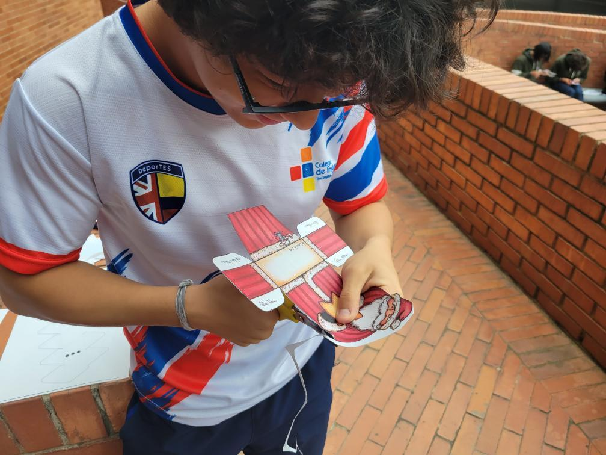
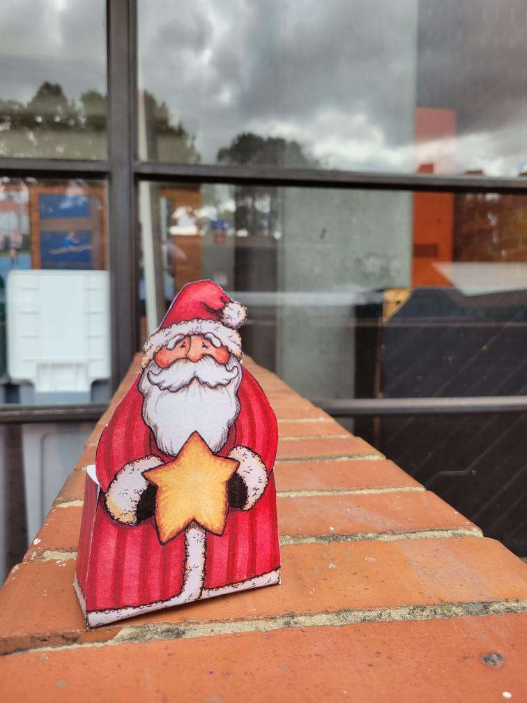
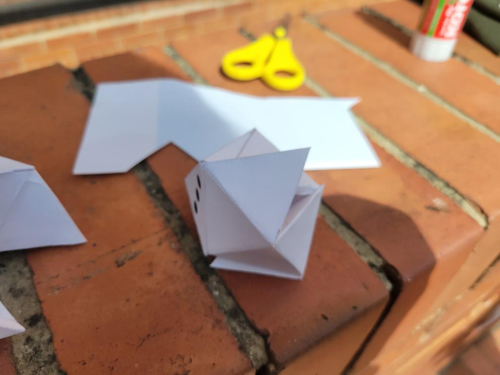
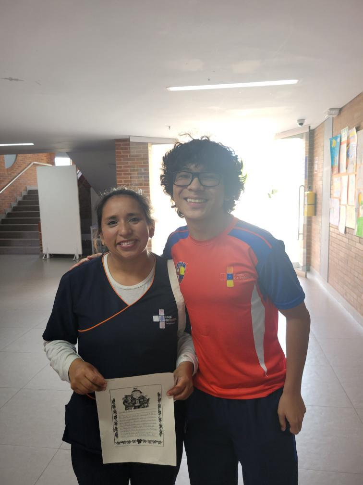

### Áreas de CAS

- **Creatividad**: Durante la actividad, tuve que ser creativo para poder decorar la ancheta de la mejor manera posible.
- Actividad
- **Servicio**: La actividad tenía como objetivo un servicio a la comunidad, pues las anchetas fueron regaladas a trabajadores del colegio.

### Etapas de CAS

- **Investigación**: Durante la actividad, aprendí sobre la importancia de la creatividad en la decoración de la ancheta, así como la importancia de la organización y la planificación.
- **Preparación**: Para prepararme para la actividad, llevé los materiales necesarios para la decoración de la ancheta.
- **Acción**: Durante la actividad, tuve que decorar la ancheta de la mejor manera posible.
- **Demostración**: Durante la actividad, demostré mi compromiso con la actividad al decorar la ancheta de la mejor manera posible.
- **Reflexión**: La realización de la actividad me hizo reflexionar sobre la importancia de la creatividad en la decoración de la ancheta, así como la importancia de la organización y la planificación.

### Atributos del IB

- Indagadores
- **Instruidos**: Siempre seguí las intrucciones de la profesora.
- **Pensadores**: Considere diversas maneras de decorar la ancheta para ser más creativo.
- **Comunicadores**: El proceso de la creación de las decoraciones de la ancheta requirio de buenas habilidades comunicativas para entender e interpretar las instrucciones de manera efectiva. Adicionalmente, la entrevista realizada a los trabajadores del colegio requirió de buenas habilidades comunicativas para poder entender sus respuestas e interpretarlas de manera efectiva en la realización de la carta.
- **Íntegros**: Ayudé a mis compañeros de clase cuando necesitaban ayuda para decorar la ancheta.
- Mente abierta
- Solidarios
- Audaces
- Balanceados
- **Reflexivos**: La realización de la actividad me hizo reflexionar sobre la importancia que pueden tener pequeños actos de amabilidad para las personas.

### Resultados de aprendizaje

- **Identificar fortalezas y debilidades**: Durante la actividad, pude evidenciar una fortaleza en mi disposición para decorar la ancheta, siempre mostrando participación activa. Mi mayor debilidad fue en mi habilidad para decorar la ancheta, particularmente en la organización de los materiales.
- **Enfrentar desafíos**: La actividad fue un reto, ya que estuvimos fuera de nuestra zona de confort en un contexto con recursos limitados. Considero que la experiencia más desafiante fue la organización de los materiales, pues resultaron en un ambiente muy caótico e incómodo en ocasiones.
- **Iniciar y planificar**: Antes de realizar la actividad, tuve que planificar la organización de los materiales y elegir las decoraciones que usaría.
- **Compromiso y perseverancia**: Demostré compromiso y perseverancia al siempre tener una buena disposición para decorar la ancheta y poniendo mi máximo esfuerzo en ello.
- Trabajo en equipo y colaborativo
- **Cuestiones de importancia global**: Esta experiencia muestra un impcto en cuestiones de importancia global como son la actitud social de indiferencia y la falta de empatía. La actividad muestra un acto de amabilidad hacia los trabajadores del colegio, lo cual puede tener un impacto positivo en la comunidad.
- **Aspecto ético**: El aspecto ético de este trabajo se basa en las implicaciones que tiene la actividad en la comunidad, pues las anchetas fueron regaladas a trabajadores del colegio. El regalo de las anchetas es un acto de amabilidad que puede tener un impacto positivo en la comunidad.

## Evidencias

