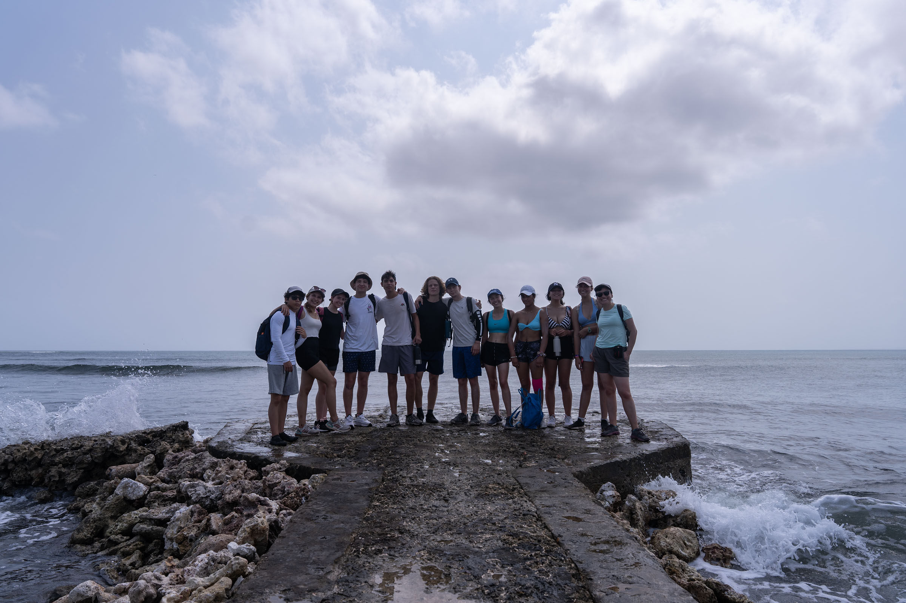

### Áreas de CAS

- **Creatividad**: Durante esta actividad CAS, demostramos nuestra creatividad en varias instancias, particularmente durante la visita al colegio de la isla. Esta actividad consistió en planificar y realizar clases de inglés para niños entre las edades de 5 a 9 años. Tuvimos que ser creativos tanto durante el proceso de planificación como durante las actividades en sí mismas, puesto a que no todo salió de acuerdo al plan e improvisación fue necesaria en ocasiones. 
- **Actividad**: Durante esta actividad CAS, hubo varios momentos en los cuales tuvimos que realizar actividad física. Por ejemplo, la actividad de kayaking requirió sustancial fuerza de espalda. Similarmente, la actividad de snorkeling necesitó fuerza en los brazos y las piernas. Y, finalmente, tanto las dos actividades previamente mencionadas como las varias caminatas que se realizaron necesitaron un buen nivel de estamina.
- **Servicio**: Durante esta actividad CAS, el servicio fue un imperativo para toda la experiencia, tanto en su aspecto social como en el medioambiental, en la actividad realizada en el colegio y las plantas de corales y manglares, respectivamente.

### Etapas de CAS

- **Investigación**: Durante el transcurso del viaje, los guías nos enseñaron sobre la fauna y flora de la isla.
- **Preparación**: Para la mayoría de las actividades realizadas en la isla, la preparación y planificación fue realizada por los guías. A pesar de esto, los estudiantes tuvimos que planificar la clase de inglés que le dictamos a los niñas en la visita al colegio de la isla.
- **Acción**: Durante nuestra estadía en la isla, la etapa de acción en el proceso CAS fue evidenciada en las múltiples actividades que realizamos, incluyendo kayaking, snorkeling, las plantas de corales y de manglares y la visita al colegio de la isla.
- **Demostración**: Luego de regresar a Bogotá, el impacto de la experiencia CAS todavía se puede demostrar a través de los corales y manglares que plantamos, que ahora contribuyen a un ecosistema más rico en la isla, así como en las clases que le dimos a los niños del colegio, quienes tuvieron un día diferente y productivo.
- **Reflexión**: Las actividades fueron acompañadas por reflexión constante, así como aprendiendo sobre la importancia de corales y manglares para el ecosistema de la isla así como pensando sobre nuestro privilegio y la importancia de la educación luego de la visita al colegio.

### Atributos del IB

- Indagadores: 
- **Instruidos**: Siempre seguí las reglas y recomendaciones establecidas por los guías y profesores acompañantes.
- Pensadores: 
- **Comunicadores**: Ciertas actividades, así como la de kayaking o cuando navegamos la cueva de Morgan, necesitaron buena comunicación para ser realizadas de manera segura y efectiva. 
- Íntegros: 
- **Mente abierta**: Demostramos una mente abierta al tener experiencias nuevas en un contexto desconocido, y al aprender de personas con una cultura muy diferente a la nuestra. 
- **Solidarios**: Demostré solidaridad con las varias actividades, particularmente hacía el medio ambiente al plantar los árboles y manglares.
- **Audaces**: Las actividades de snorkeling y la navegación de la cueva de Morgan fueron muestras de audacia, pues fueron difíciles y retadores por naturaleza.
- Balanceados
- Reflexivos

### Resultados de aprendizaje

- **Identificar fortalezas y debilidades**: Durante las actividades en la isla, pude evidenciar una fortaleza en mi disposición para realizar las actividades, siempre mostrando participación activa. Mi mayor debilidad fue en el trabajo en equipo, particularmente en la visita al colegio de la isla, porque tuve dificultad relacionándome con los niños y comunicándome de manera efectiva.
- **Enfrentar desafíos**: Todo el viaje a Isla Fuerte fue un reto, ya que estuvimos fuera de nuestra zona de confort en un contexto con recursos limitados. Considero que la experiencia más desafiante fue la navegación de la cueva de Morgan, pues resultó en un ambiente muy caliente e incómodo.
- **Iniciar y planificar**: Entre todas las actividades realizadas en la isla, la que requirió de más planificación fue sin duda la visita al colegio. Previo a la visita, tuvimos que pensar en un plan para la jornada y organizar materiales para las actividades. Fue dado a este proceso que la actividad en sí misma fue efectiva y exitosa.
- **Compromiso y perseverancia**: Demostré compromiso y perseverancia al siempre tener una buena disposición para las actividades y poniendo mi máximo esfuerzo en ellas. 
- **Trabajo en equipo y colaborativo**: El trabajo en equipo y colaborativo puede ser evidenciado principalmente en la visita al colegio de la isla, pues la planificación y realización de esta actividad requirió de un alto nivel de comunicación entre mis compañeros, así como hacía los niños del colegio para sacar el máximo provecho del proceso.
- **Cuestiones de importancia global**: Las actividades realizadas en Isla Fuerte tuvieron varias implicaciones con cuestiones de importancia global. Primero, las plantas de corales y manglares fueron actividades que tendrán un impacto positivo en el medio ambiente, particularmente al considerar la vulnerabilidad del mundo acuático en Colombia. Adicionalmente, la visita al colegio de la isla fue una experiencia valiosa en la cúal pudimos realizar un intercambio cultural de experiencias y ayudar en su desarrollo a niños de bajos recursos, con la esperanza de brindarles con más oportunidades para su futuro.
- **Aspecto ético**: Al realizar este trabajo, reconocí cuestiones éticas al proveer apoyo medioambiental y educativo a un corregimiento con una población desfavorecida, sin esperar nada a cambio. El trabajo que realizamos tanto en el colegio como en las playas y manglares representa un servicio a la comunidad de la isla que contribuirá a un futuro desarrollo sostenible de ella.

## Evidencias

