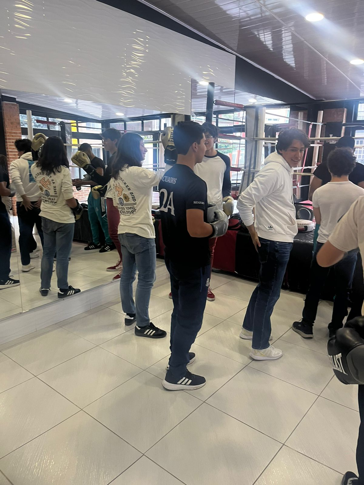
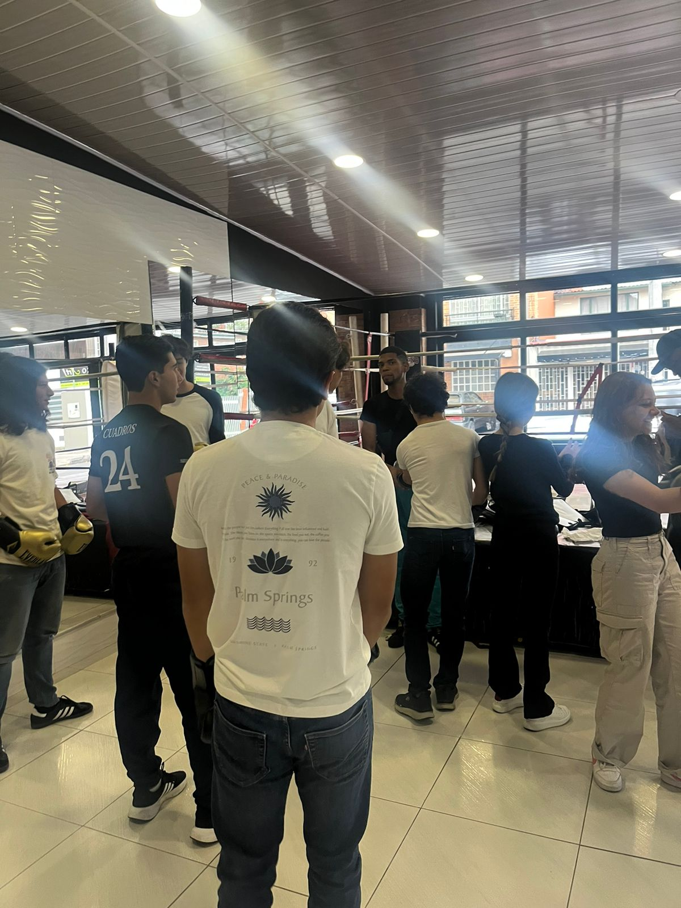
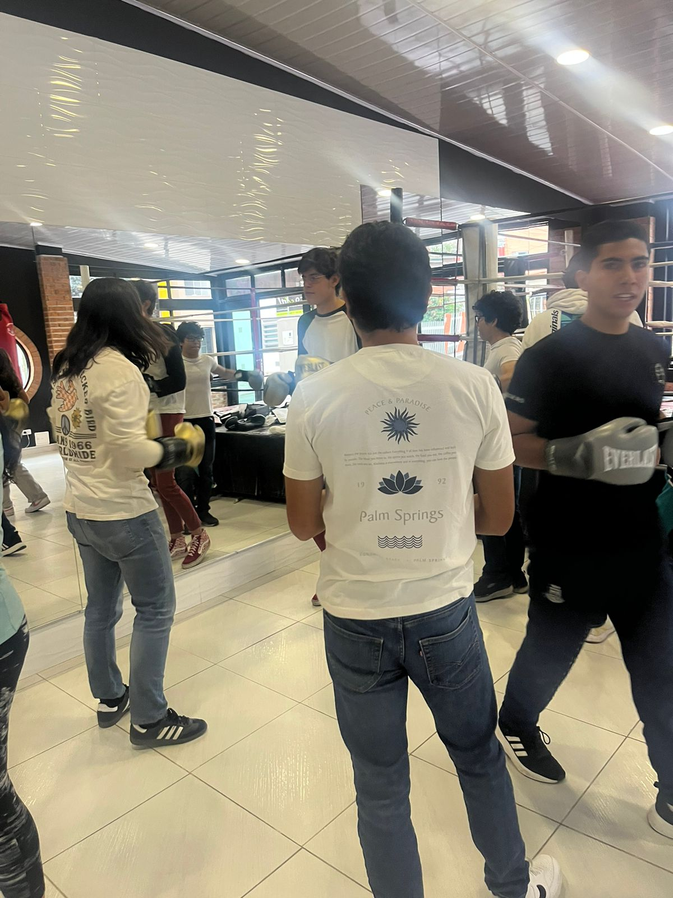
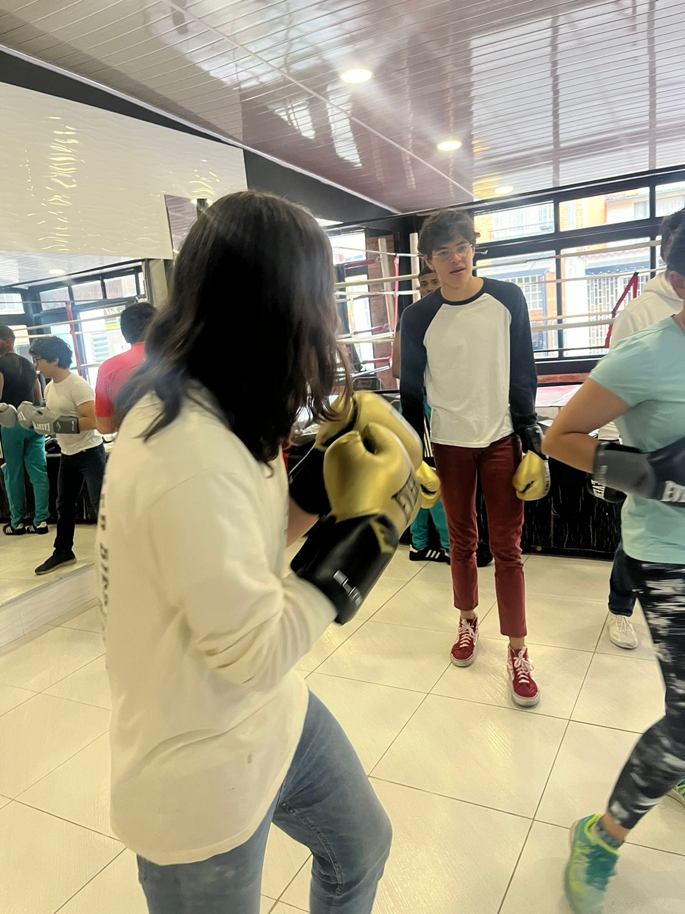
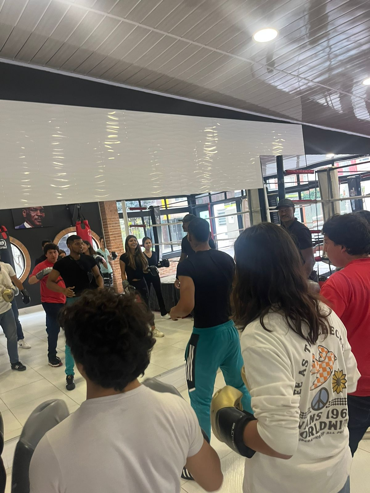
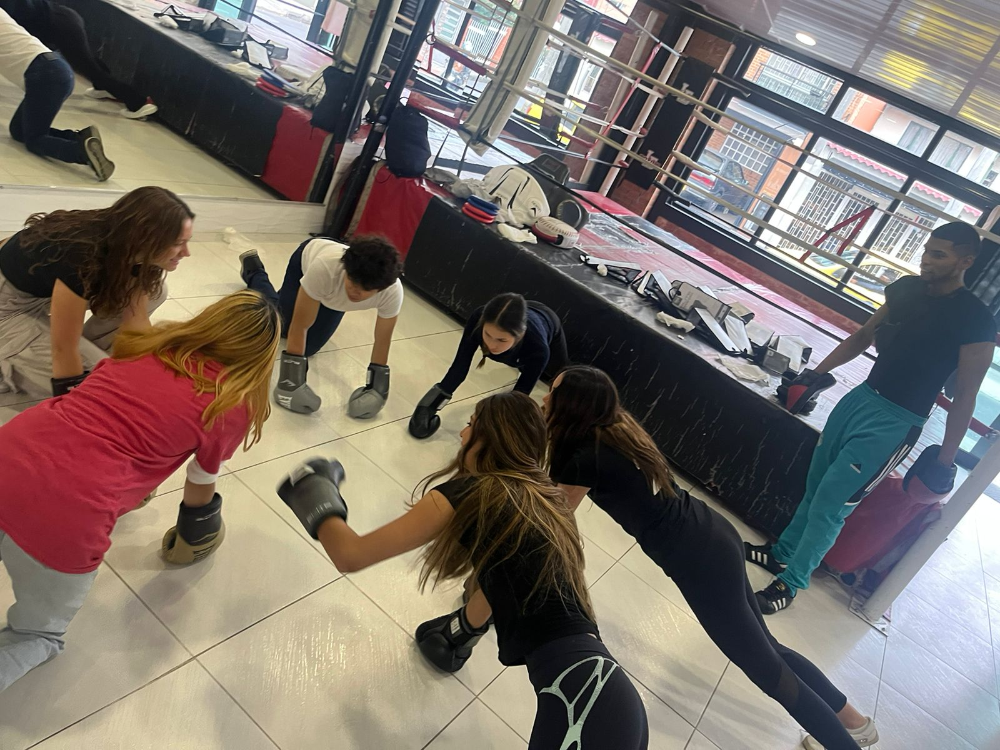

### Áreas de CAS

- **Creatividad**: No hubo elemento de creatividad en esta experiencia CAS.
- **Actividad**: Durante la actividad, tuve que realizar una serie de ejercicios físicos, los cuales fueron muy exigentes.
- **Servicio**: No hubo elemento de servicio en esta experiencia CAS.

### Etapas de CAS

- **Investigación**: Durante la actividad, aprendí sobre la importancia de mantenerse en forma y saludable, así como los beneficios de hacer ejercicio.
- **Preparación**: Para prepararme para la actividad, llevé ropa deportiva y una botella de agua.
- **Acción**: Durante la actividad, tuve que realizar una serie de ejercicios físicos, los cuales fueron muy exigentes.
- **Demostración**: Durante la actividad, demostré mi compromiso con el ejercicio y la salud al realizar los ejercicios de la mejor manera posible.
- **Reflexión**: La realización de la actividad me hizo reflexionar sobre las diversas maneras de realizar ejecicio que existen.

### Atributos del IB

- **Indagadores**: Preste atención a las explicaciones del entrenador e hice preguntas.
- **Instruidos**: Siempre seguí las intrucciones del entrenador.
- **Pensadores**: Considere diversas maneras de realizar los ejercicios para ser más eficiente.
- **Comunicadores**: Tuve que comunicarme eficientemente con mi compañero para realizar los ejercicios de manera eficaz.
- **Íntegros**: Ayudé a mis compañeros de clase cuando necesitaban ayuda para realizar los ejercicios.
- **Mente abierta**: Estuve abierto a las explicaciones del entrenador y a las sugerencias de mis compañeros.
- **Solidarios**: Ayudé a mis compañeros de clase cuando necesitaban ayuda para realizar los ejercicios.
- **Audaces**: Realicé los ejercicios de la mejor manera posible, a pesar de que eran muy exigentes.
- **Balanceados**: La actividad me ayudó a mantener un estilo de vida balanceado.
- **Reflexivos**: La realización de la actividad me hizo reflexionar sobre las diversas maneras de realizar ejecicio que existen.

### Resultados de aprendizaje

- **Identificar fortalezas y debilidades**: Durante la actividad, pude evidenciar una fortaleza en mi disposición para realizar los ejercicios, siempre mostrando participación activa. Mi mayor debilidad fue en mi habilidad para realizar los ejercicios, particularmente los que requerían una alta velocidad de reacción.
- **Enfrentar desafíos**: La actividad fue un reto, ya que estuvimos fuera de nuestra zona de confort en un contexto con recursos limitados. Considero que la experiencia más desafiante fue la realización de los ejercicios, pues resultaron en un ambiente muy caliente e incómodo en ocasiones.
- Iniciar y planificar
- **Compromiso y perseverancia**: Demostré compromiso y perseverancia al siempre tener una buena disposición para los ejercicios y poniendo mi máximo esfuerzo en ellos.
- **Trabajo en equipo y colaborativo**: El trabajo en equipo y colaborativo puede ser evidenciado principalmente en la realización de los ejercicios, pues la realización de estos requirió de un alto nivel de comunicación entre mis compañeros para sacar el máximo provecho del proceso.
- Cuestiones de importancia global
- **Aspecto ético**: El aspecto ético de este trabajo se basa en las implicaciones de la vida real de la idea de las artes marciales, que es la defensa personal. El entrenamiento de artes marciales puede ser usado para defenderse a uno mismo y a otros, y por lo tanto es una herramienta muy útil para la sociedad, pero no debe ser usada para hacer daño a otros.

## Evidencias

