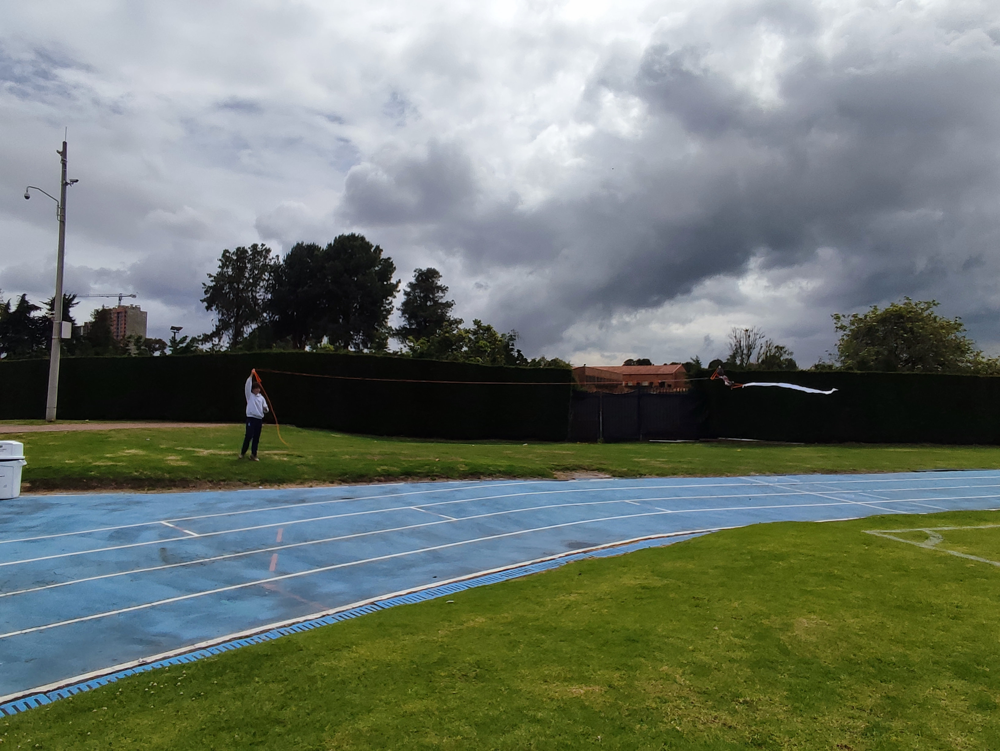

### Áreas de CAS

- **Creatividad:** Tuve que ser creativo para diseñar la cometa con los materiales limitados que tenía.
- **Actividad:** Despúes de la creación de la cometa, tuve que correr afuera durante media hora para probar si servía.
- Servicio: No hubo elemento de servicio en esta experiencia CAS.

### Etapas de CAS

- **Investigación:** Para crear nuestra cometa, tuvimos que investigar un poco, principalmente hablando con un profesor, para saber cómo crear una cometa adecuadamente.
- **Preparación:** Tuvimos que recolectar todos los materiales que necesitábamos para el proceso, como hilo y palos de madera.
- **Acción:** Después de la creación del producto, corrimos alrededor de media hora para hacer volar nuestra cometa.
- **Demostración:** Como mencione en el punto anterior, pasamos alrededor de media hora corriendo con la esperanza de que nuestra cometa funcionara.
- **Reflexión:** Al probar nuestra cometa, hubo algunos contratiempos, como que uno de los palos que usamos se rompió, y reflexionamos sobre cómo podríamos haber hecho un mejor trabajo para que la cometa fuera más duradera y efectiva.

### Atributos del IB

- **Indagadores:** Tuvimos que indagar sobre el proceso de creación de una cometa.
- **Instruidos:** Tuvimos que usar conocimientos previos durante el proceso y para volar la cometa cuando ya estaba hecha.
- **Pensadores:** Tuvimos que demostrar pensamiento crítico para diseñar una cometa que volara adecuadamente a pesar de su falta de calidad.
- **Comunicadores:** Tuvimos que mostrar buenas habilidades comunicativas para realizar el proceso efectivamente, pues era un trabajo en grupo.
- Íntegros
- Mente abierta
- Solidarios
- Audaces
- Balanceados
- **Reflexivos:** Tuvimos que demostrar capacidad para reflexionar despúes de haber realizado la actividad, pues el vuelo de la cometa no fue un éxito total, y hubo varias cosas que pudimos haber mejorado.

### Resultados de aprendizaje

- **Identificar fortalezas y debilidades:** Principalmente, soy bastante débil en manualidades.
- **Enfrentar desafios:** A pesar de mi debilidad en manualidades, afronte el reto positivamente y metí mi mejor esfuerzo para lograr la actividad propuesta.
- **Iniciar y planificar:** Durante el proceso de creación y luego uso de la cometa, mostre habilidades de organización y planificación adecuadas.
- **Compromiso y perserverancia:** A pesar de las dificultades que encontramos tanto en la creación como uso de la cometa, mi compañero y yo continuamos intentando hasta lograr que la cometa vuele.
- **Trabajo en equipo y colaborativo:** Tanto el proceso de creación como el uso de la cometa se basaba en colaboración, y siempre fue requerida buena comunicación y coordinación, tanto física como mental.
- **Cuestiones de importancia global:** Este proyecto nos ayuda a considerar las condiciones en las que viven millones de personas alrededor del mundo, y mostrar que, incluso con recursos limitados, es necesario solo tiempo y creatividad para lograr divertirse.
- **Aspecto ético:** El proyecto no tuvo muchas cuestiones éticas, aunque mi compañero y yo nos esforzamos para mantener el uso de materiales a un mínimo por preocupación por el medio ambiente.

## Evidencias

