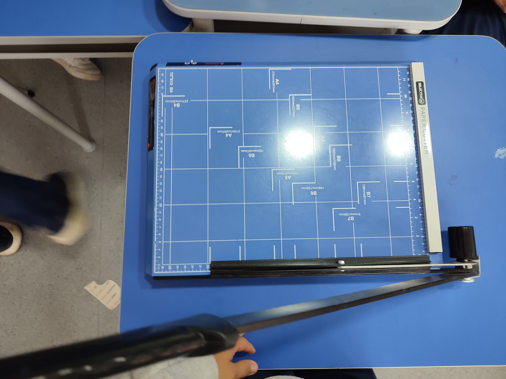

### Áreas de CAS

- Creatividad: No hubo elemento de creatividad en esta experiencia CAS.
- **Actividad:** La creación de los cuadernos no fue físicamente exigente; mi papel era simplemente cortar papel.
- **Servicio**: Los cuadernos creados durante la actividad serán donados a niños del Chocó que los necesitan.

### Etapas de CAS

- **Investigación:** Para comenzar a trabajar, tuvimos que prestar atención a las instrucciones para entender como crear los cuadernos adecuadamente.
- **Preparación:** Tuvimos que venir preparados a las sesiones con los materiales que necesitabamos, así como colores o papel. Yo trajé dos cajas de cereal, que sirvieron para crear las portadas de dos cuadernos.
- **Acción:** Nuevamente, la creación de los cuadernos no fue físicamente exigente, simplemente estuve sentado por aproximadamente dos horas cortando papel.
- **Demostración:** En sí, contribuí al trabajo con dos cajas de cereal y al cortar adecuadamente fácilmente varias cientas de hojas en las medidas correctos.
- **Reflexión:** Algunas veces, intentaba cortar demasiadas hojas a la vez, lo cual resultaba en un corte desordenado y dentado, y la pérdida de, entre las tres sesiones, aproximadamente 20 a 30 hojas. Esto me enseñó a tener mas cuidado y ser más paciente.

### Atributos del IB

- **Indagadores:** Tuvimos que prestar atención sobre el proceso de creación de un cuaderno.
- Instruidos
- Pensadores
- **Comunicadores:** Tuvimos que demostrar ciertas habilidades comunicativas para mantener un ambiente de trabajo eficiente, debido a la naturaleza de producción similar a una línea de montaje.
- Íntegros
- Mente abierta
- Solidarios
- Audaces
- Balanceados
- **Reflexivos:** El proceso de creación de los cuadernos no fue el ideal, ya que no trabajábamos a máxima productividad y, a menudo, nos distraíamos. Para mejorar, necesito poder concentrarme más y ser menos propenso a distraerme, así como ser más cuidadoso con mis decisiones, ya que desperdicié al menos un par de docenas de hojas de papel al querer cortar demasiadas a la vez.

### Resultados de aprendizaje

- **Identificar fortalezas y debilidades**: Pude usar el cortador de papel con bastante facilidady cometiendo relativamente pocos errores, aunque me distraía con frecuencia con mi teléfono o mis compañeros porque me estaba aburriendo de la tediosa tarea.
- **Enfrentar desafios:** A pesar de mi aburrimiento con la actividad, hice lo mejor que pude para limitar el tiempo que perdía y aun así trabajé mucho, contribuyendo significativamente a la cantidad total de papel que cortó mi grupo.
- **Iniciar y planificar:** Organicé los tipos de papel que estaba cortando.
- **Compromiso y perserverancia:** Mostré compromiso y perseverancia porque trabajé diligentemente durante las tres sesiones, perdiendo poco tiempo y siendo muy productivo en general.
- **Trabajo en equipo y colaborativo:** Para alcanzar los objetivos de producción que nos habíamos fijado, el proceso de producción fue una fabricación al estilo de una línea de montaje, donde la colaboración y el trabajo en equipo eran esenciales.
- **Cuestiones de importancia global:** La experiencia de CAS se basó en un tema de importancia mundial, ya que estábamos ayudando a niños desfavorecidos con uno de los derechos más importantes pero menos respetados en todo el mundo: la educación.
- **Aspecto ético:** La naturaleza de la experiencia de CAS fue éticamente correcta, ya que estábamos ayudando a los niños. Además, el método de fabricación fue muy ético, ya que utilizamos materiales reciclados. Sin embargo, la imprudencia a menudo significó que desperdiciáramos algunos de estos materiales.

## Evidencias

